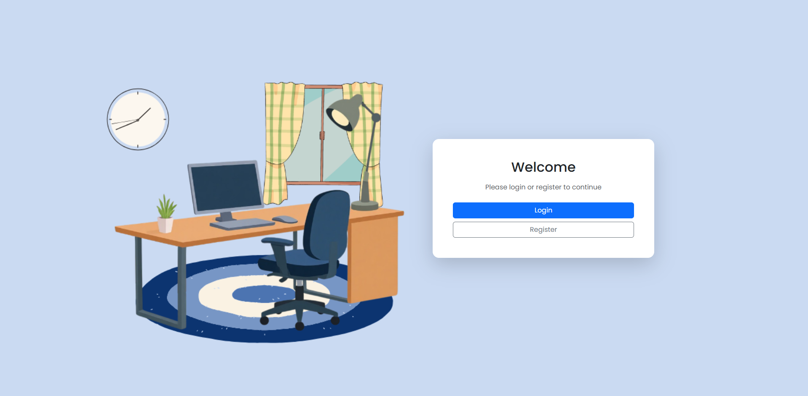
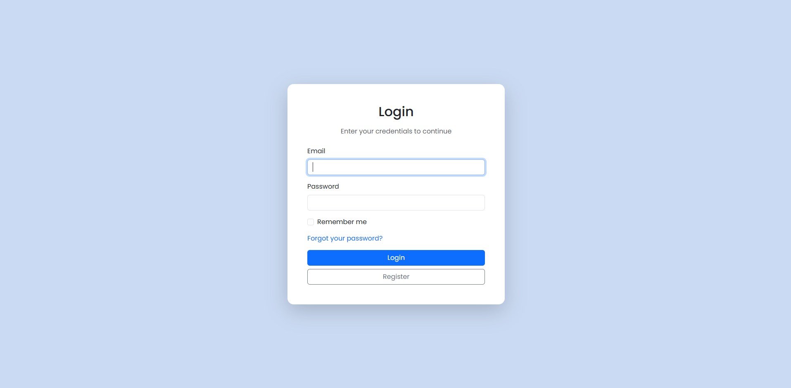
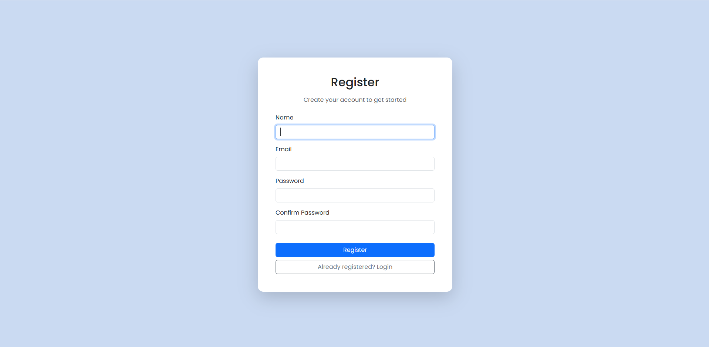
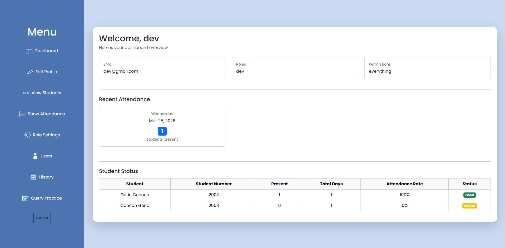
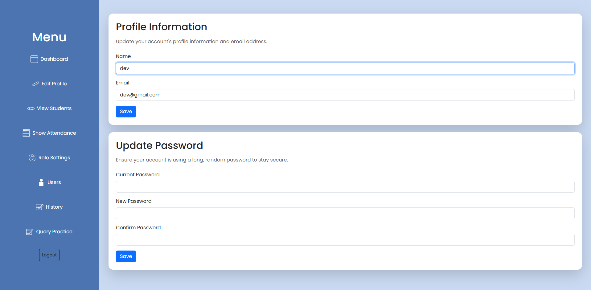
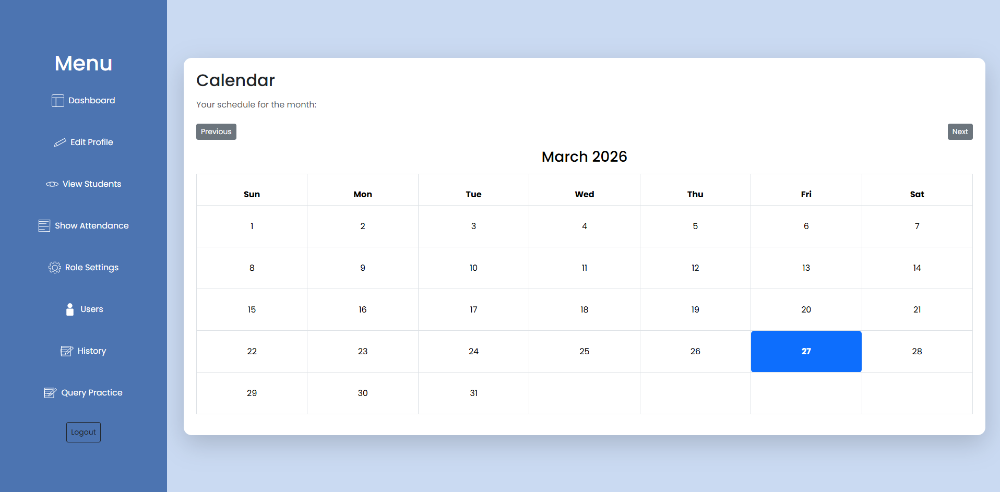
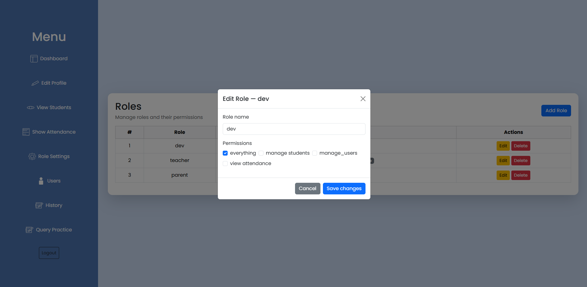
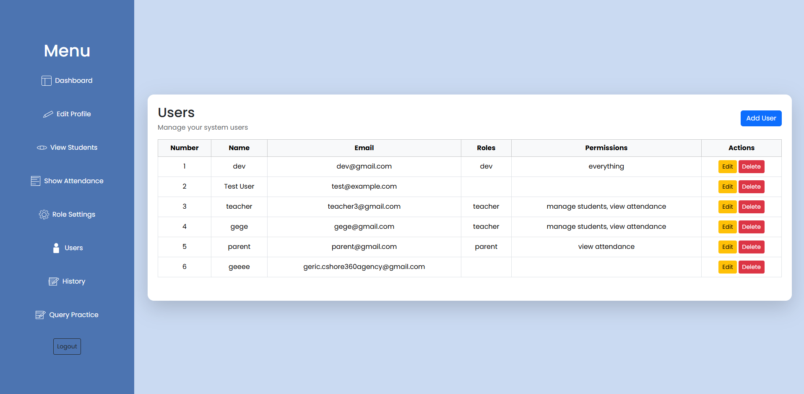
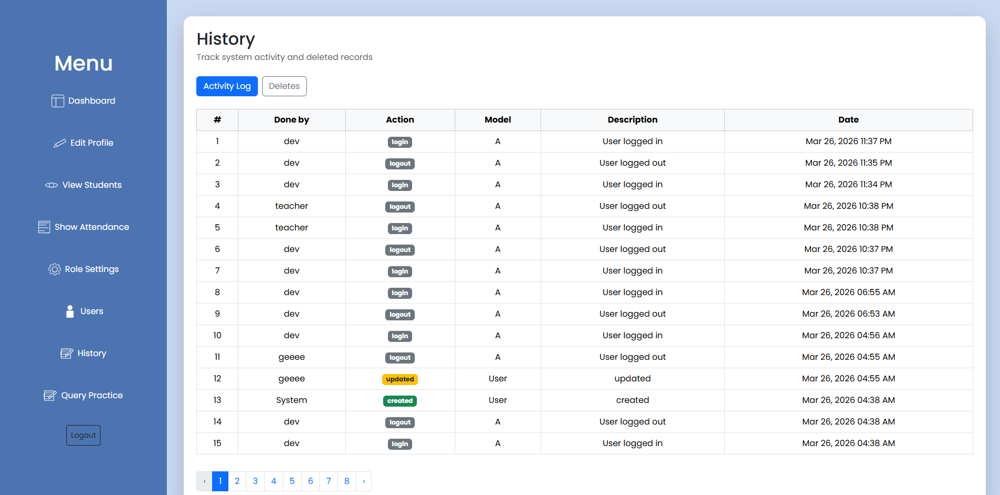

# Attendance Management System

Web-based attendance tracking for teachers that can also generate reports for parents.

---

# Features

- Teacher dashboard with attendance tracking and student list management
- Parent portal to view their child's attendance records
- QR code generation for attendance
- Role-based access control (Teacher, Parent, Dev/Admin)
- Activity logging and history

---

# Built With

- **[Laravel 12](https://laravel.com/)** — PHP web framework
- **[Laravel Breeze](https://laravel.com/docs/starter-kits#breeze)** — Authentication scaffolding
- **[Spatie Laravel Permission](https://spatie.be/docs/laravel-permission)** — Roles & permissions
- **[SimpleSoftware QR Code](https://www.simplesoftware.io/#/docs/simple-qrcode)** — QR code generation
- **[Bootstrap 5](https://getbootstrap.com/)** — Frontend styling
- **[Poppins](https://fonts.google.com/specimen/Poppins)** — Typography

---

# Installation

## Requirements
- PHP: 8.2 - 8.3
- Composer
- Node.js & NPM
- MySQL

### Steps

**1. Clone the repository**
```bash

git clone https://github.com/gericcshore360agency-hub/first_project

cd first_project

```

**2. Install dependencies**
```bash

composer install

npm install && npm run build

```

**3. Set up environment**
```bash

cp .env.example .env

php artisan key:generate

```

**4. Configure your `.env`**
```env

DB_DATABASE= your_database
DB_USERNAME= your_username
DB_PASSWORD= your_password

MAIL_MAILER=smtp
MAIL_HOST=smtp.gmail.com
MAIL_PORT=587
MAIL_USERNAME=youremail@gmail.com
MAIL_PASSWORD=your-app-password
MAIL_FROM_ADDRESS=youremail@gmail.com
MAIL_FROM_NAME="Attendance System"
```

**5. Run migrations and seeders**
```bash

php artisan migrate

php artisan db:seed

```

**6. Set up roles and permission**
```bash

php artisan tinker

use Spatie\Permission\Models\Role;

// Create roles

$dev = Role::create(['name' => 'dev']);
$teacher = Role::create(['name' => 'teacher']);
$parent = Role::create(['name' => 'parent']);

use Spatie\Permission\Models\Permission;

// Create permissions

Permission::create(['name' => 'everything']);
Permission::create(['name' => 'manage students']);
Permission::create(['name' => 'view attendance']);
Permission::create(['name' => 'manage users']);

// Assign permissions (just examples)

$dev->givePermissionTo(['everything']);
$teacher->givePermissionTo(['manage students', 'view attendance']);
$parent->givePermissionTo(['view attendance']);

**7. Start the server**
```bash

php artisan serve

```

---

## Roles

| Role | Access |
|---|---|
| **Dev** | Full system access, user management, history |
| **Teacher** | Dashboard, students, attendance, calendar |
| **Parent** | View assigned teacher's student attendance |

---

##  Mail Setup

This project uses Gmail SMTP for email verification. Follow these steps:
1. Enable 2FA on your Google account
2. Generate an App Password at myaccount.google.com → Security → App Passwords
3. Use the generated password in `MAIL_PASSWORD`

---

##  Key Packages

laravel/framework | ^12.0 | Core framework 
laravel/breeze | ^2.0 | Auth scaffolding 
spatie/laravel-permission | ^6.0 | Roles & permissions 
spatie/laravel-activitylog | ^4.0 | Activity logging 
simplesoftwareio/simple-qrcode | ^4.0 | QR code generation 


##  Screenshots

### Welcome Page:


### Login Page:


### Register Page:


### Dashboard:


### Edit Profile:


### View Students:


### Show Attendance:


### Role Settings:


### Users:


### History:



